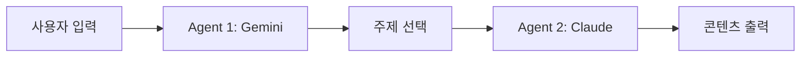

# 🤖 멀티 에이전트 워크플로우 시스템

n8n에서 영감을 받은 **AI 에이전트 오케스트레이션** 시스템입니다.
여러 AI 모델(Gemini, Claude, GPT)의 장점을 결합하여 블로그 콘텐츠를 자동으로 생성합니다.

## 📋 목차

- [시스템 개요](#-시스템-개요)
- [에이전트 구조](#-에이전트-구조)
- [설치 방법](#-설치-방법)
- [사용 방법](#-사용-방법)
- [아키텍처](#-아키텍처)
- [확장 계획](#-확장-계획)

---

## 🎯 시스템 개요

이 시스템은 블로그 콘텐츠 생성 과정을 5단계로 자동화합니다:

```
업종 입력 → 주제 기획 → 글 작성 → 검수 → 이미지 생성 → 자동 퍼블리싱
```

각 단계는 해당 작업에 가장 적합한 AI 모델이 담당합니다.

---

## 🤝 에이전트 구조

| 에이전트 | 모델 | 역할 | 상태 |
|---------|------|------|------|
| **Agent 1** | Gemini 1.5 Pro | 업종 분석 및 주제 기획 | ✅ 구현 완료 |
| **Agent 2** | Claude 3.5 Sonnet | 플랫폼별 맞춤 글 작성 | ✅ 구현 완료 |
| **Agent 3** | GPT-4o | 팩트 체크 및 검수 | 🚧 예정 |
| **Agent 4** | GPT-4o + DALL-E 3 | 이미지 생성 | 🚧 예정 |
| **Agent 5** | Python API | 네이버/티스토리 퍼블리싱 | 🚧 예정 |

### 현재 구현된 기능 (v0.1)

✅ **Agent 1 (Gemini)**: 업종별 인기 키워드 및 주제 추천
✅ **Agent 2 (Claude)**: 네이버/티스토리/구글 플랫폼별 맞춤 글 작성
✅ **LangGraph 워크플로우**: 에이전트 간 상태 전달

---

## 🚀 설치 방법

### 1. 저장소 클론

```bash
git clone <repository-url>
cd n8n
```

### 2. Python 가상환경 생성

```bash
python -m venv venv
source venv/bin/activate  # Windows: venv\Scripts\activate
```

### 3. 의존성 설치

```bash
pip install -r requirements.txt
```

### 4. 환경 변수 설정

`.env.example` 파일을 복사하여 `.env` 파일을 생성합니다:

```bash
cp .env.example .env
```

`.env` 파일을 열고 API 키를 입력합니다:

```env
GOOGLE_API_KEY=your_gemini_api_key_here
ANTHROPIC_API_KEY=your_claude_api_key_here
OPENAI_API_KEY=your_openai_api_key_here
```

#### API 키 발급 방법

- **Gemini**: https://makersuite.google.com/app/apikey
- **Claude**: https://console.anthropic.com/
- **OpenAI**: https://platform.openai.com/api-keys

---

## 💻 사용 방법

### 기본 실행 (대화형 모드)

```bash
python main.py
```

실행 시 업종을 입력하면 자동으로 워크플로우가 진행됩니다:

```
📝 업종을 입력하세요 (예: 세무사, 변호사, 카페): 세무사
```

### 출력 예시

```
🚀 멀티 에이전트 워크플로우 시작
📌 업종: 세무사

🤖 Agent 1 (Gemini) - 주제 기획 중...

🎯 추천 주제 목록:
1. 키워드: 종합소득세 절세
   제목: 세무사가 알려주는 종합소득세 절세 꿀팁 5가지
   이유: 5월 종합소득세 신고 시즌에 검색량이 급증하는 주제

🤖 Agent 2 (Claude) - 콘텐츠 작성 중...

📝 생성된 콘텐츠:
【NAVER 버전】
톤: friendly
안녕하세요! 😊 오늘은 종합소득세 절세 팁을 알려드릴게요...

【TISTORY 버전】
톤: professional
## 종합소득세란?
종합소득세는 개인이 1년간 벌어들인 소득에 대해...

✅ 워크플로우 완료!
```

---

## 🏗️ 아키텍처

### 파일 구조

```
n8n/
├── main.py                 # 메인 실행 스크립트
├── workflow_state.py       # 워크플로우 상태 정의
├── workflow_graph.py       # LangGraph 워크플로우
├── agent_planner.py        # Agent 1: Gemini 기획 에이전트
├── agent_writer.py         # Agent 2: Claude 작가 에이전트
├── requirements.txt        # Python 의존성
├── .env.example           # 환경 변수 예시
└── README.md              # 이 파일
```

### 데이터 흐름



### 상태 관리 (WorkflowState)

LangGraph의 `StateGraph`를 사용하여 에이전트 간 데이터를 전달합니다:

```python
class WorkflowState(TypedDict):
    business_type: str              # 입력: 업종
    topic_suggestions: List[Topic]  # Agent 1 → Agent 2
    selected_topic: Topic           # 선택된 주제
    content_versions: List[Content] # Agent 2 → Agent 3
    ...
```

---

## 🔮 확장 계획

### Phase 2: 검수 및 이미지 생성

- [ ] **Agent 3 (GPT-4o)**: 팩트 체크 및 문법 검토
  - 검수 실패 시 Agent 2로 루프백
  - 최대 재시도 횟수 제한

- [ ] **Agent 4 (DALL-E 3)**: 블로그 썸네일 이미지 자동 생성

### Phase 3: 자동 퍼블리싱

- [ ] **Agent 5**: 네이버/티스토리 API 연동
  - 자동 게시 기능
  - 예약 발행 기능

### Phase 4: UI 개선

- [ ] Streamlit 웹 인터페이스
- [ ] n8n 스타일의 시각적 워크플로우 에디터
- [ ] 실시간 진행 상황 표시

---

## 🛠️ 기술 스택

- **Python 3.8+**
- **LangGraph**: 에이전트 오케스트레이션
- **LangChain**: AI 모델 통합
- **Gemini 1.5 Pro**: 주제 기획
- **Claude 3.5 Sonnet**: 콘텐츠 작성
- **GPT-4o** (예정): 검수 및 이미지 생성

---

## 📝 라이선스

MIT License

---

## 🙋 문의 및 기여

문제가 발생하거나 기능 제안이 있으시면 Issue를 생성해주세요.

Pull Request도 환영합니다! 🎉
